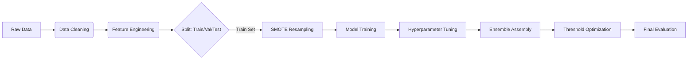

# 📘 Student Success Prediction Pipeline: Comprehensive Technical Report

## Overview
This document serves as a comprehensive technical guide to the Student Success Prediction pipeline. It consolidates the engineering guide, architectural review, and fine-tuning plans into a single source of truth.

---

# Part 1: Engineer's Guide

## 1. Pipeline Architecture
The pipeline is orchestrated by `run_pipeline.py` and implemented in `src/train_pipeline.py`. It follows a strict sequential workflow designed to prevent **data leakage** and ensure **reproducibility**.

### **High-Level Data Flow**


### **Key Architectural Decisions**
1.  **Leakage Guard**: We explicitly drop features that would not be available at the time of prediction (e.g., 2nd-semester grades if predicting early). This is handled in `DataLoader._apply_leakage_guard`.
2.  **Post-Split Resampling**: **CRITICAL**. SMOTE (Synthetic Minority Over-sampling Technique) is applied *only* to the training set *after* splitting.
    *   *Why?* If we upsample before splitting, synthetic copies of a validation point could end up in the training set, causing massive overfitting (data leakage).
3.  **Macro F1 Optimization**: We optimize for Macro F1 rather than Accuracy.
    *   *Why?* The "Enrolled" class is a minority. A model that ignores "Enrolled" students can still get high accuracy but fails the business objective of identifying at-risk students.

---

## 2. Deep Dive: Feature Engineering
Located in: `src/data/feature_engineering.py`

Feature engineering is the "secret sauce" of this pipeline. We transform raw transactional data into behavioral signals.

### **Category 1: Academic Trajectory (`AcademicFeatures`)**
Raw grades capture a static snapshot. We care about *momentum*.

| Feature | Logic | Rationale |
| :--- | :--- | :--- |
| `grade_improvement` | `Sem2_Grade - Sem1_Grade` | A student improving from 10→12 is safer than one dropping 14→12. |
| `approval_rate` | `Units_Approved / Units_Enrolled` | Measures efficiency. Low approval rate (<50%) is a massive red flag. |
| `eval_efficiency` | `Units_Evaluated / Units_Enrolled` | Measures effort. A student who enrolls but doesn't show up for exams (0 evals) is "ghosting". |

### **Category 2: Engagement Signals (`EngagementFeatures`)**
Dropout is rarely sudden; it's a process of disengagement.

| Feature | Logic | Rationale |
| :--- | :--- | :--- |
| `course_load_change` | `Sem2_Enrolled - Sem1_Enrolled` | A sudden drop in course load often precedes dropout. |
| `units_without_eval` | `Enrolled - Evaluated` | The "Ghosting" metric. High values indicate the student has mentally checked out. |
| `engagement_risk_score` | Composite Score (0-5) | Combines load reduction, ghosting, and zero-enrollment flags into a single integer risk level. |

### **Category 3: Financial Risk (`FinancialFeatures`)**
Financial stress is a primary driver of dropout.

| Feature | Logic | Rationale |
| :--- | :--- | :--- |
| `financial_risk` | `Debtor OR Unpaid_Tuition` | Binary flag. If a student owes money, they are administratively blocked from re-enrolling. |
| `economic_stress_index` | `Norm(Unemployment) + Norm(Inflation) - Norm(GDP)` | Macro-economic context. Students drop out more during economic downturns. |
| `financial_vulnerability` | `Personal_Risk + Macro_Risk` | Interaction term. A debtor in a bad economy is at maximum risk. |

### **Category 4: Demographic Context (`DemographicFeatures`)**
Used to identify students needing specific support structures.

| Feature | Logic | Rationale |
| :--- | :--- | :--- |
| `family_education_avg` | `(Mother_Qual + Father_Qual) / 2` | Proxy for "First Generation Student". These students often lack family guidance on navigating university bureaucracy. |
| `is_mature_student` | `Age > 25` | Mature students face different pressures (jobs, kids) than 18-year-olds. |

---

## 3. Model Specifications
Located in: `src/models/`

We use tree-based models because they naturally handle non-linear interactions (e.g., *High Tuition is bad, UNLESS Scholarship is True*).

### **1. Random Forest (`RandomForestModel`)**
*   **Role**: The stabilizer. Low variance, hard to overfit.
*   **Key Params**:
    *   `class_weight='balanced'`: Penalizes mistakes on minority classes more heavily.
    *   `oob_score=True`: Uses "Out-of-Bag" samples for free validation during training.

### **2. XGBoost (`XGBoostModel`)**
*   **Role**: The performance driver.
*   **Mechanism**: Sequential boosting. Tree 2 fixes Tree 1's mistakes.
*   **Key Params**:
    *   `scale_pos_weight`: Adjusted dynamically for class imbalance.
    *   `early_stopping_rounds`: Prevents overfitting by stopping training when validation score plateaus.

### **3. LightGBM (`LightGBMModel`)**
*   **Role**: Speed and efficiency.
*   **Mechanism**: Leaf-wise growth (grows complex trees faster).
*   **Note**: Can overfit on small datasets, so we heavily regularize `min_child_samples`.

---

## 4. Threshold Optimization (The "Hidden" Booster)
Standard models predict a class if Probability > 0.5. This is suboptimal for imbalanced data.

**Our Approach (`ThresholdOptimizer`):**
1.  We get raw probabilities from the model (e.g., `[0.6, 0.3, 0.1]` for `[Dropout, Enrolled, Graduate]`).
2.  We apply custom multipliers found via Grid Search on the validation set.
    *   *Example*: Multiply "Enrolled" probability by 1.2x.
3.  **Result**: The model becomes more sensitive to the "Enrolled" class, significantly boosting Macro F1 without retraining.

---

## 5. Guide for Interns & Future Work

### **How to Add a New Feature**
1.  Open `src/data/feature_engineering.py`.
2.  Create a new Transformer class (e.g., `SocialFeatures`).
3.  Implement `transform()`. **Rule**: Must handle missing values and division-by-zero.
4.  Add it to `StudentFeatureEngineer.__init__`.

### **How to Add a New Model**
1.  Open `src/models/`.
2.  Create a wrapper class (e.g., `SVMModel`) that implements `fit()`, `predict()`, and `predict_proba()`.
3.  Add it to the `train_baselines()` or `train_ensembles()` method in `TrainingPipeline`.

### **Common Pitfalls to Avoid**
*   **Target Leakage**: Never use features that reveal the future (e.g., "Date of Graduation").
*   **Data Snooping**: Never fit scalers or encoders on the *entire* dataset. Always `fit` on Train, `transform` on Test.
*   **Metric Fixation**: Don't just look at Accuracy. Always check the **Confusion Matrix** in `artifacts/plots/` to see *who* is being misclassified.

---

# Part 2: Refined ML Architecture Review

**Review Date:** November 2025
**Reviewer:** Senior ML Engineer

## 📋 Executive Summary: Key Refinements

After reviewing the original implementation plan, I've identified several areas for improvement to align with production ML best practices. Think of the original plan as a solid blueprint for a house—it has all the rooms in the right places, but a senior architect would add structural reinforcements, better insulation, and emergency exits.

### Critical Refinements Made:

1. **Data Validation First** - Added Pandera schemas before any modeling
2. **Stratified Sampling Strategy** - Refined split methodology for class imbalance  
3. **Baseline Hierarchy** - Added "Most Frequent" baseline (often missed)
4. **Cost-Sensitive Learning** - Added class weight optimization
5. **Calibration** - Added probability calibration for reliable predictions
6. **Fairness Monitoring** - Critical for educational applications
7. **Production Pipeline** - sklearn Pipeline objects for reproducibility

---

## 🧠 Understanding the Problem: An Analogy

Imagine you're a doctor trying to predict which of three outcomes a patient will have: **full recovery**, **ongoing treatment**, or **condition worsening**. 

- **Dropout** = Condition worsening (we want to catch this early!)
- **Enrolled** = Ongoing treatment (monitoring needed)
- **Graduate** = Full recovery (our success case)

Just like in medicine, **missing a potential dropout is worse than falsely flagging a future graduate**. This asymmetry shapes our entire approach.

---

## 📊 Dataset Characteristics & Implications

### What We're Working With:

| Aspect | Value | Implication |
|--------|-------|-------------|
| Samples | 4,425 | Medium-sized; tree-based models excel here |
| Features | 35 | Manageable; no dimensionality reduction needed |
| Classes | 3 | Multi-class; requires One-vs-Rest or native multi-class support |
| Feature Types | Mixed | Needs proper encoding strategies |

### The Class Imbalance Challenge

With 3 classes, we likely have imbalance. Here's why it matters:

**Analogy:** Imagine you're training a spam filter, but 95% of your emails are ham. A lazy model could achieve 95% accuracy by always predicting "ham"—but it would catch zero spam! Similarly, if most students graduate, a model predicting everyone graduates would look accurate but miss all dropouts.

**Solution:** We'll use stratified sampling and class-weighted loss functions.

---

## 🏗️ Model Selection Strategy: The "Why" Behind Each Choice

### Tier 0: Sanity Baselines (The "Dumb" Models)

These aren't meant to win—they're guardrails. If our fancy model doesn't beat these, something is wrong.

#### 1. Most Frequent Baseline
```
Always predicts the most common class
```
**Why Include?** Sets the absolute floor. If 60% of students graduate, this achieves 60% accuracy with zero learning.

#### 2. Stratified Random Baseline
```
Randomly guesses proportional to class distribution
```
**Why Include?** Expected performance of random guessing. Macro F1 ≈ 0.33 for 3 balanced classes.

---

### Tier 1: Interpretable Models (The "Glass Box")

These models let us see inside. Critical for educational applications where we need to explain decisions.

#### 3. Logistic Regression (Multi-class via Softmax)

**How It Works:** 
Draws straight lines (hyperplanes) to separate classes. For each class, it learns: "Students with high grades AND low financial stress tend to graduate."

**Why Include?**
- Coefficients directly show feature importance
- Fast to train and predict
- Strong baseline that often surprises you

---

### Tier 2: Non-Linear Models (The "Pattern Finders")

#### 4. Random Forest Classifier

**How It Works:**
Builds many decision trees, each trained on a random subset of data and features. Final prediction = majority vote.

**Why Include?**
- Handles non-linear relationships
- Provides feature importance rankings
- Robust to outliers and missing values
- Minimal preprocessing required

#### 5. Gradient Boosting (XGBoost/LightGBM)

**How It Works:**
Builds trees sequentially. Each new tree focuses on correcting the mistakes of all previous trees combined.

**Why Include?**
- State-of-the-art for tabular data
- Native handling of class imbalance (`scale_pos_weight`)
- Built-in regularization prevents overfitting

#### 6. Support Vector Machine (SVM)

**How It Works:**
Finds the hyperplane that maximizes the margin between classes. The "kernel trick" projects data into higher dimensions where it becomes linearly separable.

**Why Include?**
- Effective when classes are separable
- Works well with medium-sized datasets
- The kernel trick captures complex boundaries

#### 7. K-Nearest Neighbors (KNN)

**How It Works:**
To predict for a new student: find the K most similar students in training data, take majority vote of their outcomes.

**Why Include?**
- No assumptions about data distribution
- Captures local patterns
- Simple to understand and explain

---

### Tier 3: Ensemble Methods (The "Committee")

#### 8. Voting Classifier (Soft Voting)

**How It Works:**
Combines predictions from multiple models. Soft voting averages probability estimates; hard voting takes majority class.

**Why Include?**
- Reduces variance (individual model quirks cancel out)
- Often outperforms any single model
- Simple to implement and explain

#### 9. Stacking Classifier

**How It Works:**
Base models make predictions → those predictions become features → meta-model learns optimal combination.

**Why Include?**
- Learns which models to trust for which situations
- Can outperform simple voting
- State-of-the-art ensemble technique

---

## ⚖️ Class Imbalance Strategies

### Strategy 1: Class Weights
**Concept:** Penalize mistakes on minority classes more heavily.
```python
class_weight='balanced'
```

### Strategy 2: SMOTE (Synthetic Minority Oversampling)
**Concept:** Create synthetic examples of minority classes by interpolating between existing examples.
**Caution:** Only apply to training data, never validation/test!

### Strategy 3: Stratified Sampling
**Concept:** Ensure each fold/split has the same class proportions.

---

## 🛡️ Fairness Considerations

### Why Fairness Matters in Education
An ML model that systematically disadvantages certain demographic groups could:
- Deny support to students who need it most
- Perpetuate historical inequities
- Create legal liability

### Fairness Metrics to Monitor
1. **Demographic Parity:** Positive prediction rates should be similar across groups
2. **Equal Opportunity:** True positive rates should be similar across groups
3. **Predictive Parity:** Precision should be similar across groups

---

## 🔄 Production Pipeline Design

### Why Pipelines Matter
Without pipelines, you'll face:
- Data leakage (fitting scaler on test data)
- Training/serving skew (different preprocessing at inference)
- Reproducibility nightmares

### Pipeline Structure
```python
from sklearn.pipeline import Pipeline
from sklearn.compose import ColumnTransformer

# Full pipeline with model
pipeline = Pipeline([
    ('preprocessor', preprocessor),
    ('classifier', RandomForestClassifier())
])
```

---

# Part 3: Model Fine-Tuning Plan

## Current Baseline
- **Best Model**: Stacking Ensemble (Macro F1: 0.7076)
- **Weak Point**: Enrolled class (F1: 0.52)
- **Class Distribution**: Graduate 50%, Dropout 32%, Enrolled 18%

---

## Phase 1: Feature Engineering Integration
**Problem**: The `StudentFeatureEngineer` in `src/data/feature_engineering.py` creates 20+ engineered features but is NOT used in the pipeline.
**Action**: Integrate feature engineering into `src/train_pipeline.py` `DataLoader.load_data()` method.
**Expected Impact**: +2-5% Macro F1

## Phase 2: Class Imbalance Handling
**Problem**: Enrolled class (18%) is underrepresented and underperforming.
**Actions**:
1. **Add SMOTE oversampling** for minority class in training data
2. **Optimize class weights** - compute optimal weights based on inverse frequency
3. **Add threshold tuning** - adjust classification thresholds per class
**Expected Impact**: +3-8% on Enrolled F1 specifically

## Phase 3: Hyperparameter Tuning
**Action**: Add `RandomizedSearchCV` with 50 iterations for top models.
**Key parameters to tune**:
- **XGBoost**: `max_depth`, `learning_rate`, `n_estimators`, `subsample`, `colsample_bytree`, `min_child_weight`
- **LightGBM**: `num_leaves`, `max_depth`, `learning_rate`, `n_estimators`, `reg_alpha`, `reg_lambda`
- **Random Forest**: `n_estimators`, `max_depth`, `min_samples_leaf`, `max_features`
**Expected Impact**: +2-4% Macro F1

## Phase 4: Ensemble Optimization
**Actions**:
1. **Optimize voting weights** - instead of equal weights, use validation performance as weights
2. **Add calibration** - CalibratedClassifierCV for better probability estimates
3. **Try different meta-learners** for stacking (Ridge, GradientBoosting)
**Expected Impact**: +1-2% Macro F1

## Phase 5: Threshold Optimization
**Action**: Instead of argmax(probabilities), find optimal thresholds per class to maximize Macro F1.
**Implementation**: Grid search over threshold combinations on validation set.
**Expected Impact**: +1-3% on minority class (Enrolled) without sacrificing other classes

## Phase 6: Documentation & Reporting
**Action**: Create `REPORT.md` in project root that documents:
- Baseline metrics before any changes
- Results after each phase with delta improvements
- Best hyperparameters found
- Feature importance rankings
- Confusion matrices comparison
- Final recommendations

## Phase 7: Comprehensive Experiment Tracking & Analysis
**Purpose**: Document ALL steps, approaches, and their individual contributions to show the technical behind-the-scenes of our work.

### 7.1 Experiment Logging Structure
Each experiment in `REPORT.md` will be documented with:
- **Hypothesis**: What we expected to happen
- **Approach**: Detailed description of what we tried
- **Configuration**: Parameters, Data transformations, Model settings
- **Results**: Before/After metrics
- **Analysis**: Why it worked/didn't work

### 7.2 Ablation Study
Document the contribution of each component:
- Baseline (no changes)
- + Feature Engineering
- + SMOTE
- + Class Weights
- + Hyperparameter Tuning
- + Ensemble Optimization
- + Threshold Tuning

### 7.3 Failed Approaches & Lessons Learned
Document what DIDN'T work (equally important).

---

## Estimated Improvements

| Metric | Current | Target | Method |
|--------|---------|--------|--------|
| Macro F1 | 0.7076 | 0.75-0.78 | All phases combined |
| Enrolled F1 | 0.52 | 0.60-0.65 | SMOTE + threshold tuning |
| Dropout F1 | 0.77 | 0.80+ | Hyperparameter tuning |
| Graduate F1 | 0.83 | 0.85+ | Feature engineering |
| Accuracy | 73.95% | 77-80% | All phases combined |
